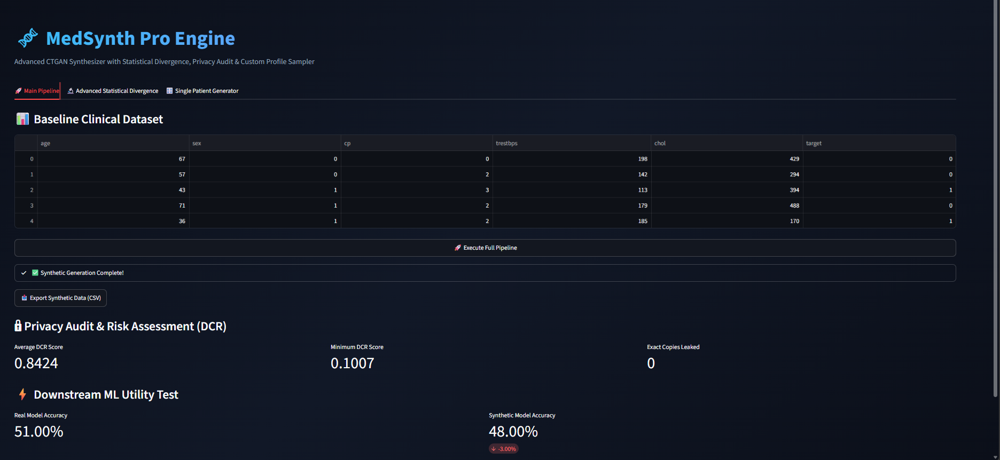
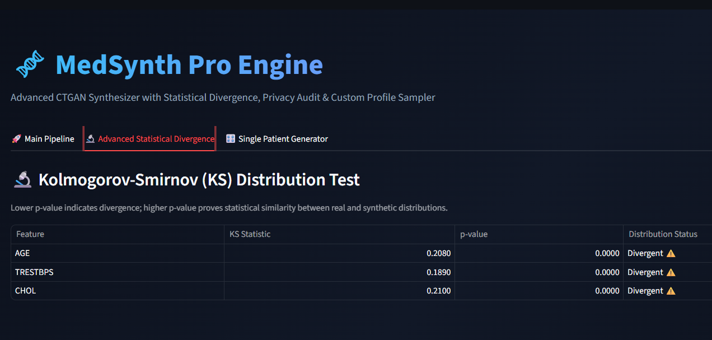
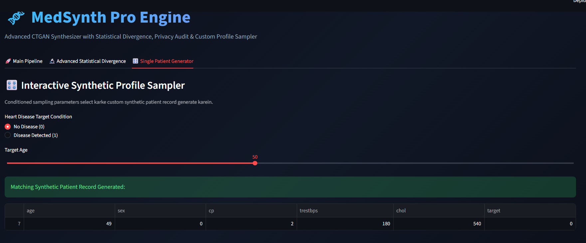

### 📸 Interface & Dashboard Previews

#### 1. Main Pipeline & Privacy Risk Assessment (DCR)


#### 2. Advanced Statistical Divergence (KS-Test)


#### 3. Interactive Synthetic Profile Sampler


# Privacy-Preserving Synthetic Medical Data Generation (CTGAN)
An end-to-end privacy-preserving synthetic data generation pipeline for tabular medical record using Consitional GANs (CTGAN). Includes statistical validation, Distance to Closest Record (DCR) privacy auditing, downstream ML utility evaluation, and a Streamlit dashboard.
## Features
- **CTGAN Synthesizer**: Generation privacy-preserving tabular health records.
- **Statistical Validation**: Feature correlation matrices & density distribution plots.
- **Privacy Assurance**: Evaluates Distance to Closest Record (DCR) to ensure zero exact copies.
- **ML Utility Test**: Evaluates downstream Random Forest model performance.
- **Interactive UI**: Streamlit dashboard for real-time model execution and CSV downloads.

## Project Structure

```text
.
├── app.py                   # Streamlit Web Dashboard
├── data_prep.py             # Data Preprocessing Script
├── train_ctgan.py           # CTGAN Model Training Script
├── validate_data.py         # Statistical Validation Script
├── evaluate_privacy.py      # DCR Privacy Audit Script
├── downstream_ml.py         # Downstream Machine Learning Test
└── clean_medical_data.csv   # Baseline Clean Dataset
```